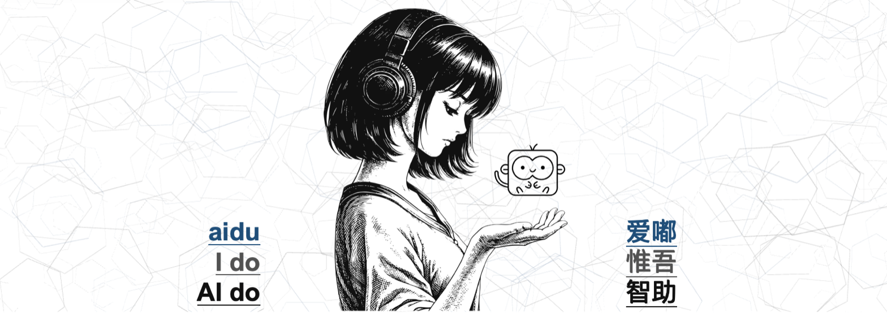
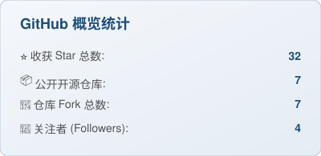
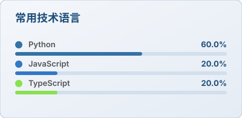

  

  
  
  
  

  
  
  
  
  
  

---

## 🏛️ aidu Matrix 

> *aidu, I do! AI do.* —— 不会写代码的小猴和他的monkey² Works

<table align="center">
  <thead>
    <tr>
      <th align="center">族谱</th>
      <th align="center">定位</th>
      <th align="center">仓库</th>
    </tr>
  </thead>
  <tbody>
    <tr>
      <td align="left"><b>aiduMEI⚕️爱嘟优忆思</b></td>
      <td align="left">智能体通用智慧引擎·双引擎全自动</td>
      <td align="center"></td>
    </tr>
    <tr>
      <td align="left"><b>aiduPOP⚕️爱嘟泡波浪</b></td>
      <td align="left">Hermes飞书极简定制流式卡片</td>
      <td align="center"></td>
    </tr>
    <tr>
      <td align="left"><b>aiduHUI⚕️爱嘟心视界</b></td>
      <td align="left">Hermes Agent极简WebUI</td>
      <td align="center"></td>
    </tr>
    <tr>
      <td align="left"><b>aiduPARK⚕️爱嘟乐园</b></td>
      <td align="left">HERMES AGENT非中文第一社区</td>
      <td align="center"><a href="https://www.aidupark.com">www.aiduPARK.com</a></td>
    </tr>
    <tr>
      <td align="left"><b>aiduGPT⚕️爱嘟白月光</b></td>
      <td align="left">网页版免费ChatGPT化身全权限本地API</td>
      <td align="center"></td>
    </tr>
  </tbody>
</table>

## 📊 GitHub Summary

  
  
  

## 🐍 贡献贪吃蛇

  <picture>
    <source media="(prefers-color-scheme: dark)" srcset="https://raw.githubusercontent.com/monkey2jack/monkey2jack/output/snake-dark.svg"/>
    
  </picture>

---

  
  

